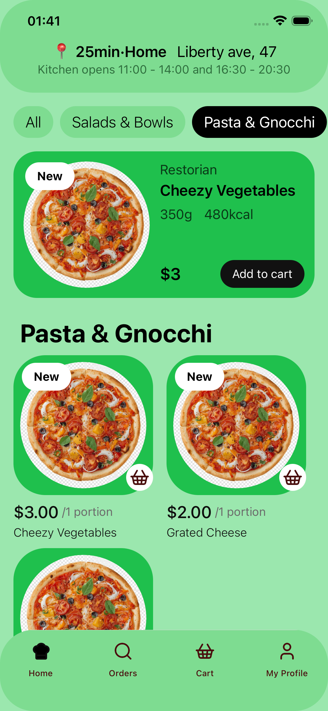
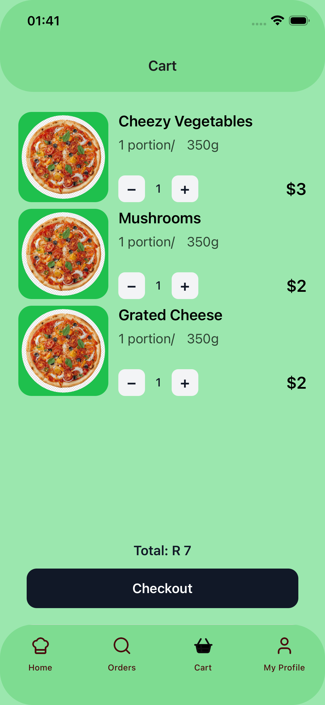
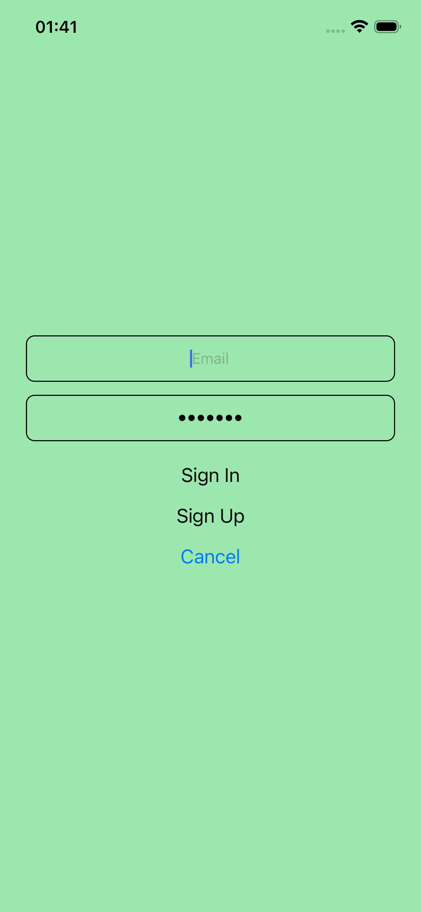
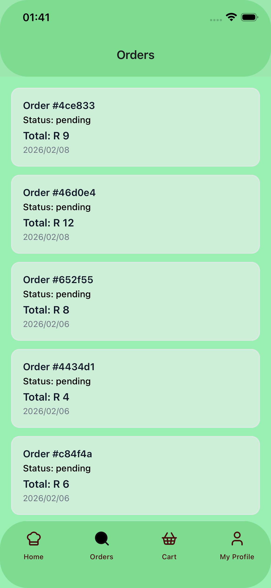
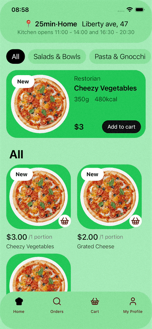

# Food app - An app for ordering food

<!-- markdownlint-disable MD045 -->
<!-- markdownlint-disable MD033 -->

  
  <!--  -->
  
  
  

    Below is a short screen recording demonstrating adding products into the cart and order creation

    

## Overview

The food app is a demonstration on building a multi-screen application that are sharing a global state. Using Supabase as the backend and Expo (React Native) as the frontend, this app allows a user to add items into the cart without proving credentials, when the user presses the checkout button, the app promps the user to login before creating/viewing their existing orders.

## Project Status

This project is intended as a portfolio demonstration of end-to-end mobile app development.

## Tech Stack

- Mobile: Expo (React Native)
- Language: TypeScript
- Backend: Supabase (PostgreSQL, Auth)
- Database: PostgreSQL
- Security: Row Level Security (RLS), database triggers & functions
- Tooling: Git, GitHub, VS Code, Bash Terminal

## Features

- User authentication and session-based data access for orders

### Intentional UX

The app focused on ensuring a consisten green theme throughout the application.

## Running the app locally

- git clone <https://github.com/nkolonzilucky/nozeebakes>
- cd nozeebakes
- npm install
- Ensure to have a .env file, and enter your Supabase metadata
- npx expo start
